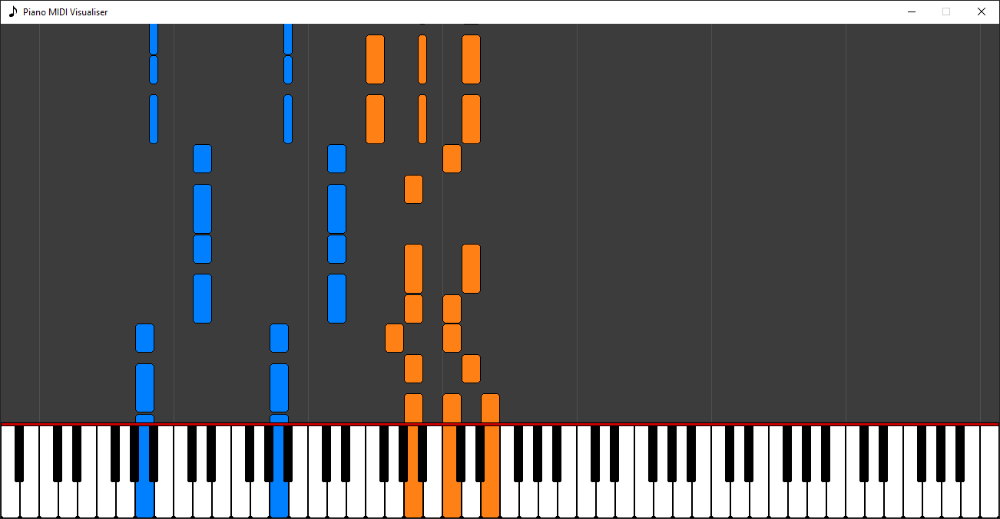
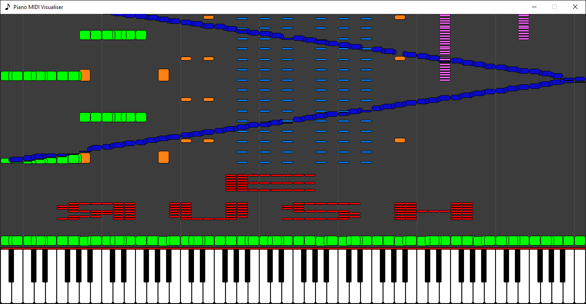

# MIDI Visualiser
Program to visualise MIDI songs on a virtual piano. 
Uses the mido library for loading and interpreting MIDI files, and pygame for the display. 

## Screenshots

Simple 2 channel piano song.

Rush E

## Instructions for use
Clone the project
```bash
git clone git@github.com
```
